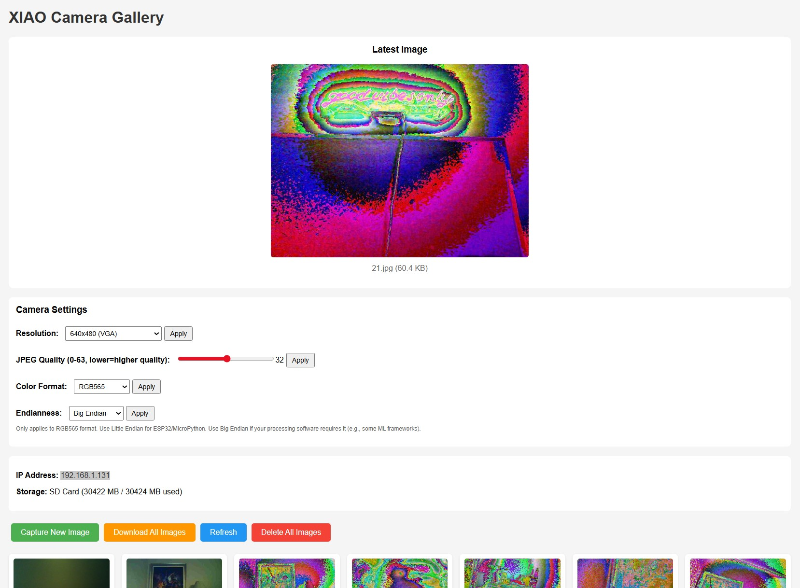

# XIAO Sense ESP32 Photo Capture + Web Server

A complete photo capture system for the XIAO ESP32S3 Sense board with web server interface for viewing, managing, and downloading images. All images are saved as JPEG files to SD card with support for multiple pixel formats (RGB, Grayscale, RGB565).



## Features

- **Multiple Capture Methods**: Button (D0), serial command, or web interface
- **Web Gallery**: View all captured images with download and delete options
- **Flexible Image Formats**: 
  - RGB (JPEG) - Standard color images
  - Grayscale - Black and white JPEG images
  - RGB565 - 16-bit color with endianness support
- **Camera Settings**: Adjustable resolution, quality, pixel format, and endianness
- **SD Card Storage**: Sequential file naming (1.jpg, 2.jpg, 3.jpg...)
- **Real-time Settings**: Change camera settings via web interface without recompiling

## Hardware Requirements

- **XIAO ESP32S3 Sense** (with Sense expansion board)
- **Built-in camera module** (on Sense expansion board)
- **Built-in microSD card slot** (on Sense expansion board)
- **MicroSD card** (up to 32GB, formatted as FAT32)
- **WiFi network** (2.4GHz only - ESP32 doesn't support 5GHz)

## Quick Start

### 1. SD Card Preparation

1. Format your microSD card as **FAT32**
2. Insert the SD card into the Sense expansion board's SD card slot
3. Ensure the card is properly seated

### 2. Software Setup

#### PlatformIO (Recommended)

1. Open the project folder in VS Code with PlatformIO extension installed
2. Edit `src/main.cpp` and update WiFi credentials:
   ```cpp
   const char* ssid = "YOUR_WIFI_NETWORK_NAME";
   const char* password = "YOUR_WIFI_PASSWORD";
   ```
3. Ensure Sense expansion board is properly installed with SD card inserted
4. Build and upload: Click the checkmark icon, then arrow icon
5. Monitor: Click the plug icon (115200 baud)

#### Arduino IDE

1. Install ESP32 board support:
   - File → Preferences → Additional Board Manager URLs: 
     `https://raw.githubusercontent.com/espressif/arduino-esp32/gh-pages/package_esp32_index.json`
   - Tools → Board → Boards Manager → Install "esp32 by Espressif Systems"

2. Select board: Tools → Board → ESP32 Arduino → XIAO_ESP32S3

3. Configure settings:
   - Tools → Partition Scheme → Default 3MB with spiffs
   - Tools → PSRAM → OPI PSRAM
   - Tools → CPU Frequency → 240MHz

4. Update WiFi credentials in `src/main.cpp`

5. Upload sketch

### 3. First Run

1. Open Serial Monitor (115200 baud)
2. Check for successful initialization:
   - Camera initialized successfully
   - SD card initialized successfully
   - WiFi connected
   - IP address displayed
3. **Note**: It may take a few minutes for everything to fully initialize and start working. Be patient and wait for all initialization messages in the Serial Monitor before using the web interface.
4. Open web browser to the displayed IP address or `http://xiaocamera.local`

## Usage

### Serial Commands (115200 baud)

- `c` - Capture image
- `d` - Delete all images
- `l` - List all images
- `h` - Show help
- `w` - Display web interface URL

### Web Interface

Access via IP address (shown in Serial Monitor) or `http://xiaocamera.local`

**Features:**
- **Latest Image**: Displays most recently captured image
- **Camera Settings**: 
  - Resolution: 96x96 to 1600x1200
  - JPEG Quality: 0-63 slider (lower = higher quality)
  - Color Format: RGB (JPEG), Grayscale, RGB565
  - Endianness: Little Endian or Big Endian (for RGB565)
- **Capture**: Take new photos
- **Gallery**: View all captured images with thumbnails
- **Download**: Download individual images or all images as ZIP
- **Delete**: Remove all images

### Camera Settings Explained

- **Resolution**: 
  - QQVGA (96x96), QVGA (240x240), VGA (640x480)
  - SVGA (800x600), XGA (1024x768), SXGA (1280x1024), UXGA (1600x1200)
  
- **JPEG Quality**: 0-63 (lower numbers = higher quality, larger files)
  - Default: 12 (good balance)
  - For high-resolution captures, quality is automatically optimized

- **Color Format**:
  - **RGB (JPEG)**: Standard color images, fastest capture
  - **Grayscale**: Black and white images, saved as grayscale JPEG
  - **RGB565**: 16-bit color format, useful for ML/computer vision applications

- **Endianness**: Only applies to RGB565 format
  - **Little Endian**: Default for ESP32/MicroPython
  - **Big Endian**: Use if your processing software requires it (e.g., some ML frameworks)

## File Format

All images are saved as **JPEG files** (`.jpg` extension) with sequential numbering:
- 1.jpg, 2.jpg, 3.jpg, etc.
- Files are stored on the SD card root directory
- Format is preserved: Grayscale images are true grayscale JPEGs, RGB565 images maintain their color characteristics

## Troubleshooting

### SD Card Issues

- **SD card initialization fails**: 
  - Check SD card is inserted and formatted as FAT32
  - Try a different SD card
  - Check Serial Monitor for specific error messages
  - Ensure SD card is not write-protected

### Camera Issues

- **Camera fails to initialize**: 
  - Check camera module is properly connected on Sense expansion board
  - Verify expansion board is properly seated
  - Check Serial Monitor for error codes
  - Try power cycling the device

- **VSYNC overflow errors**: 
  - Normal for high-resolution captures, camera will retry automatically
  - If persistent, try lower resolution or different pixel format

### WiFi Issues

- **WiFi connection fails**: 
  - Verify SSID/password are correct
  - Ensure 2.4GHz network (ESP32 doesn't support 5GHz)
  - Check WiFi signal strength
  - Check Serial Monitor for connection status

- **Web interface inaccessible**: 
  - Verify IP address from Serial Monitor
  - Ensure device and computer are on same WiFi network
  - Try accessing via IP address instead of mDNS name (`http://xiaocamera.local`)
  - Check firewall settings

### Image Capture Issues

- **Images not saving**: 
  - Check SD card is initialized (see Serial Monitor)
  - Verify SD card has free space
  - Check file permissions (SD card should be writable)
  - For high-resolution RGB565, processing may take longer - wait for completion

- **Settings not applying**: 
  - Some settings require camera reinitialization (resolution, pixel format)
  - Check Serial Monitor for initialization messages
  - Refresh web page after changing settings

## Technical Details

- **Storage**: SD card via SPI interface (built-in on Sense expansion board)
- **Image Format**: JPEG (JPG files) - all formats converted to JPEG
- **Web Server**: Port 80, HTTP
- **mDNS**: xiaocamera.local
- **Serial**: 115200 baud
- **Frame Buffer**: PSRAM when available, DRAM otherwise
- **Image Conversion**: Uses ESP32 camera library's `fmt2jpg()` for format conversion

## Project Structure

```
data capture/
├── src/
│   └── main.cpp          # Main program code
├── platformio.ini        # PlatformIO configuration
├── README.md             # This file
└── PLATFORMIO.md         # PlatformIO quick reference
```
